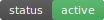

<p align="center">
  
  
  
</p>

<h1 align="center">Interface Notes</h1>

<p align="center">
  <b>AI-powered interface documentation tool — scan, print, handwrite, OCR back.</b>
</p>

---

## What is this?

**Interface Notes** is a CLI tool that helps teams understand and document a codebase's interfaces (functions / methods) through a human-in-the-loop workflow:

| # | Step | What happens |
|---|------|-------------|
| 1 | **AI scans** | Identifies public interfaces, parameters, return types, IO risks, and call relationships |
| 2 | **AI exports** | A clean Markdown doc with built-in handwriting zones (optimized for A4 printing) |
| 3 | **You print → handwrite** | Notes, warnings, pitfalls go directly on paper — zero tab-switching |
| 4 | **OCR flows back** | Photograph your notes, run the tool, and handwritten context merges into the digital doc with risk levels auto-upgraded |

The result is not a static doc — it's a **growing team brain** that lives between code, paper, and AI.

---

## Two Modes

| Mode | Scenario | Token Cost | Precision |
|------|-----------|-------------|-----------|
| **Mode A — Co-develop** | New project / active development | Low (incremental) | High (real-time confirmation) |
| **Mode B — Inherit** | Legacy code / previous dev left / onboarding | High (one-shot full scan) | Medium → High (after human correction) |

---

## Four-Phase Lifecycle

| Phase | Driver | Action | Output |
|-------|--------|---------|---------|
| 1 | AI | Identify interfaces → ask → record | `Session` (JSON) |
| 2 | AI + Human | Review → export .md → auto-generate diagram | `INTERFACE_NOTES.md` |
| 3 | Human | Print → handwrite → photograph → OCR merge | Handwritten notes merged in |
| 4 | Human + AI | New dev reads notes → new Session imports → AI answers instantly | Team knowledge base |

---

## Quick Start

### Install

```bash
# Core (stdlib only — no mandatory third-party deps)
pip install -r requirements.txt

# Optional: enable real OCR (requires tesseract binary + lang packs)
pip install pytesseract pillow
# Ubuntu:  sudo apt-get install tesseract-ocr tesseract-ocr-chi-sim
# macOS:    brew install tesseract tesseract-lang
```

### Mode B — Inherit a legacy project

```bash
# 1. Full scan + auto-export v1
python -m interface_notes mode-b \
  --project "LegacyProject" \
  --path ./legacy_code \
  --auto-export \
  --output INTERFACE_NOTES_v1.md

# 2. Print v1 → handwrite → photograph → OCR merge → v2
python -m interface_notes ocr-merge \
  --image handwritten_notes.jpg \
  --author "Alice" \
  --output INTERFACE_NOTES_v2.md
```

### Mode A — Co-develop (incremental)

```bash
python -m interface_notes mode-a \
  --project "NewProject" \
  --path ./src
```

### Other commands

```bash
python -m interface_notes show           # Session status
python -m interface_notes add --name my_func --description "does X" --location "src/main.py"
python -m interface_notes diagram       # Print Mermaid graph only
python -m interface_notes export --format json --output notes.json
python -m interface_notes test         # Run all tests
```

---

## Supported Languages

| Language | Status | Extracts |
|----------|:-------:|----------|
| Python (.py) | ✅ | Signature, type hints, IO detection, call graph |
| JavaScript (.js/.jsx) | ✅ | Function decl/expr, params, IO detection |
| TypeScript (.ts/.tsx) | ✅ | Above + type annotations |
| Java (.java) | ✅ | Public methods, Javadoc, param types |
| Go / Rust | 🔜 | Planned |

---

## Project Structure

```
interface-notes/
├── README.md
├── README_EN.md              # This file (English)
├── README_ZH.md              # 中文版 README
├── LICENSE
├── .gitignore
├── requirements.txt
├── REPOSITORY_DESCRIPTION.txt
├── .github/
│   ├── workflows/tests.yml          # CI: run tests on push/PR
│   ├── ISSUE_TEMPLATE/
│   │   ├── bug_report.md
│   │   └── feature_request.md
│   └── pull_request_template.md
├── interface_notes/                 # Main package
│   ├── __main__.py
│   ├── cli.py
│   ├── core/
│   │   ├── session.py
│   │   └── types.py
│   ├── analyzer/
│   │   └── code_analyzer.py
│   ├── exporter/
│   │   ├── markdown_exporter.py
│   │   └── diagram.py
│   └── ocr/
│       └── ocr_engine.py
├── prompts/                         # AI prompt templates (6 files)
├── examples/                        # Sample markdown outputs
└── tests/                           # Test suites (36 cases, all passing)
```

---

## Design Principles

| Principle | Explanation |
|-----------|-------------|
| **AI → skeleton, Human → flesh** | AI records objective facts; humans add subjective experience |
| **Don't annoy** | Each interface is asked at most once; silence on uncertainty |
| **Print-friendly** | Exports optimized for A4 paper, not screen reading |
| **Closed loop** | Handwrite → photo → OCR → merged → upgraded export |
| **Cross-session** | Notes export as files; new Sessions can import them |
| **Progressive enhancement** | v1 records + exports; v2 adds diagrams; v3 adds OCR |

---

## Roadmap

- [x] v1 — Mode A: incremental identify + ask + record + export .md
- [x] v1b — Mode B: full scan + disclaimer + export .md
- [x] v2 — Auto-generate Mermaid interface call graphs
- [x] v3 — OCR photo merge + auto risk-level upgrade
- [x] Cross-file same-name disambiguation (qualified_name + import-aware)
- [x] Optional OCR deps (works without pytesseract)
- [x] `max_files` truncation warning
- [ ] v4 — Multi-project merge → personal tech dictionary
- [ ] v5 — IDE plugin (pop-up like Copilot)

---

## GitHub Topics

Recommended tags (Settings → Topics):

`ai` `documentation` `code-analysis` `static-analysis` `cli-tool` `mermaid` `ocr` `developer-tools` `python` `codebase-visualization`

---

## Contributing

Issues and PRs welcome. Please run `python -m interface_notes test` before submitting.

---

## License

MIT License — see [LICENSE](LICENSE) for details.

---

<p align="center">
  Made with ❤️ for teams who still believe in the power of paper + pen.
</p>
