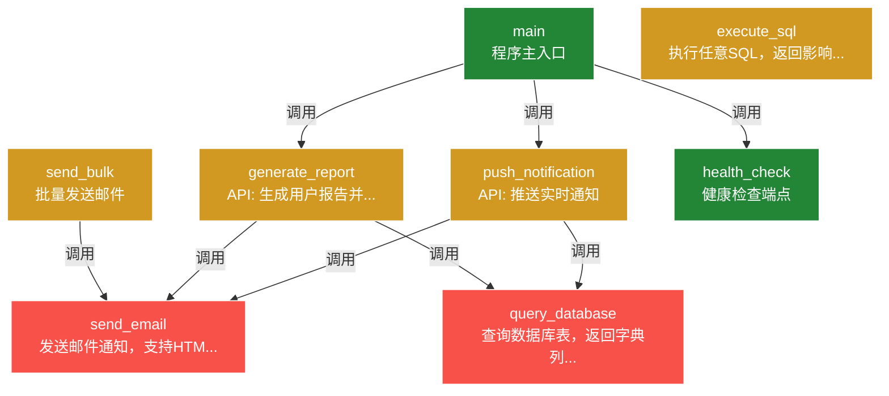

# 接口笔记 — 演示项目

> *ℹ️ 本文档已通过人工校验（v2+），如有疑问请联系维护者。*

> 生成时间：2026-07-17 05:09
> 接口总数：8
> 版本：v2
> 生成方式：AI全量扫描 + 用户手写批注

## execute_sql 🟡
- **功能**：执行任意SQL，返回影响行数
- **参数**：
  - `sql` (str)
- **返回**：int
- **位置**：`db/query.py`
- **调用了**：（无）
- **风险**：🟡 中（涉及IO操作但未设置超时）

> 📝 手写区（打印后在此写你的理解/踩坑经验）：
>
> _______________________________________________________
>
> _______________________________________________________
>
> _______________________________________________________

---

## generate_report 🟡
- **功能**：API: 生成用户报告并发送邮件
- **参数**：
  - `user_id` (int)
  - `report_type` (str)
- **返回**：str
- **位置**：`api/endpoints.py`
- **调用了**：`send_email`, `query_database`
- **被调用**：`main`
- **风险**：🟡 中（涉及IO操作但未设置超时）

> 📝 手写区（打印后在此写你的理解/踩坑经验）：
>
> 模板在 templates/report.html
> 改样式找前端小张 （手写-张三-07/17）
>
> _______________________________________________________
>
> _______________________________________________________
>
> _______________________________________________________

---

## health_check 🟢
- **功能**：健康检查端点
- **参数**：（无）
- **返回**：dict
- **位置**：`api/endpoints.py`
- **调用了**：（无）
- **被调用**：`main`
- **风险**：🟢 低

> 📝 手写区（打印后在此写你的理解/踩坑经验）：
>
> _______________________________________________________
>
> _______________________________________________________
>
> _______________________________________________________

---

## main 🟢
- **功能**：程序主入口
- **参数**：（无）
- **返回**：（未确定）
- **位置**：`main.py`
- **调用了**：`generate_report`, `push_notification`, `health_check`
- **风险**：🟢 低

> 📝 手写区（打印后在此写你的理解/踩坑经验）：
>
> _______________________________________________________
>
> _______________________________________________________
>
> _______________________________________________________

---

## push_notification 🟡
- **功能**：API: 推送实时通知
- **参数**：
  - `user_id` (int)
  - `message` (str)
- **返回**：bool
- **位置**：`api/endpoints.py`
- **调用了**：`send_email`, `query_database`
- **被调用**：`main`
- **风险**：🟡 中（涉及IO操作但未设置超时）

> 📝 手写区（打印后在此写你的理解/踩坑经验）：
>
> _______________________________________________________
>
> _______________________________________________________
>
> _______________________________________________________

---

## query_database 🔴
- **功能**：查询数据库表，返回字典列表
- **参数**：
  - `table` (str)
  - `condition` (dict)
- **返回**：list
- **位置**：`db/query.py`
- **调用了**：（无）
- **被调用**：`generate_report`, `push_notification`
- **风险**：🔴 高（涉及IO操作但未设置超时）

> 📝 手写区（打印后在此写你的理解/踩坑经验）：
>
> 🔴 这里超时没设！
> 上次生产环境卡死就是这个接口
> → 加 timeout=10 就行
> → 老王写的，他离职了，有问题问小李 （手写-张三-07/17）
> [风险升级] 手写批注提到：超时
>
> _______________________________________________________
>
> _______________________________________________________
>
> _______________________________________________________

---

## send_bulk 🟡
- **功能**：批量发送邮件
- **参数**：
  - `emails` (list)
  - `template` (str)
- **返回**：dict
- **位置**：`utils/email.py`
- **调用了**：`send_email`
- **风险**：🟡 中（涉及IO操作但未设置超时）

> 📝 手写区（打印后在此写你的理解/踩坑经验）：
>
> 注意：超过100封会触发API限流
> → 待优化，加分批逻辑
> 找小张聊过，他有方案 （手写-张三-07/17）
>
> _______________________________________________________
>
> _______________________________________________________
>
> _______________________________________________________

---

## send_email 🔴
- **功能**：发送邮件通知，支持HTML和纯文本
- **参数**：
  - `to` (str)
  - `subject` (str)
  - `body` (str)
  - `html` (bool)
- **返回**：bool
- **位置**：`utils/email.py`
- **调用了**：（无）
- **被调用**：`send_bulk`, `generate_report`, `push_notification`
- **风险**：🔴 高（涉及IO操作但未设置超时）

> 📝 手写区（打印后在此写你的理解/踩坑经验）：
>
> ⚠️ 163邮箱要单独配SMTP！
> 密码不是登录密码，是授权码
> （踩坑2026-07-16，排查了3小时）
> → 找老王问过，他说用SSL端口465 （手写-张三-07/17）
> [风险升级] 手写批注提到：坑
>
> _______________________________________________________
>
> _______________________________________________________
>
> _______________________________________________________

---

## 📊 接口关系图

> 🔴 红色 = 高风险 | 🟡 黄色 = 中风险 | 🟢 绿色 = 稳定

---

> *本文档由 AI 辅助生成并经人工校验，如有错误请联系维护者。*