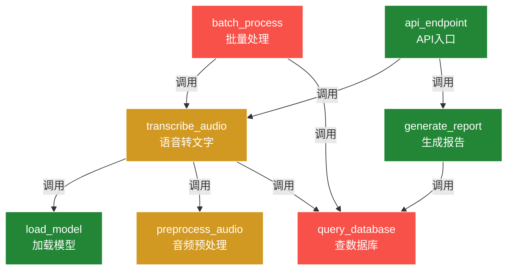

# ⚠️ 接口笔记 — AI语音项目（全量扫描 v1）

> **⚠️ 该内容由 AI 全量扫描生成，请仔细甄别。**
> **AI 可能误判接口边界、调用关系或参数含义。**
> **请打印后在手写区修正，拍照回流后生成更精准的 v2 版。**

> 扫描时间：2026-07-17
> 扫描文件数：47
> 接口数量：12
> Token 消耗：~85k（一次性）
> AI 置信度：中等（待人工校验）

---

## transcribe_audio 🟡

- **功能**：AI的理解：将音频文件转为文字
- **参数**：
  - `audio_path` (str) - 音频文件路径
  - `language` (str) - 语言代码，如 'zh'、'en'
  - `model` (str) - 使用的模型名称
- **返回**：dict - 包含 text、confidence、duration
- **位置**：`core/transcribe.py`
- **调用了**：`load_model`, `preprocess_audio`, `query_database`
- **被调用**：`batch_process`, `api_endpoint`
- **风险**：🟡 中（未设置超时，大文件可能阻塞）

> 📝 手写区（打印后在此写你的理解/踩坑经验）：
>
> _______________________________________________________
>
> _______________________________________________________
>
> _______________________________________________________

---

## load_model 🟢

- **功能**：AI的理解：加载语音识别模型到内存
- **参数**：
  - `model_name` (str) - 模型名称
  - `device` (str) - 运行设备 'cpu' 或 'cuda'
- **返回**：Model对象
- **位置**：`core/models.py`
- **调用了**：（无）
- **被调用**：`transcribe_audio`, `translate_audio`
- **风险**：🟢 低

> 📝 手写区（打印后在此写你的理解/踩坑经验）：
>
> _______________________________________________________
>
> _______________________________________________________
>
> _______________________________________________________

---

## preprocess_audio 🟡

- **功能**：AI的理解：音频预处理（降噪、归一化、分帧）
- **参数**：
  - `audio_data` (bytes) - 原始音频数据
  - `sample_rate` (int) - 采样率
- **返回**：numpy.ndarray
- **位置**：`core/audio_utils.py`
- **调用了**：（无）
- **被调用**：`transcribe_audio`
- **风险**：🟡 中（采样率不匹配时会崩溃，缺错误处理）

> 📝 手写区（打印后在此写你的理解/踩坑经验）：
>
> _______________________________________________________
>
> _______________________________________________________
>
> _______________________________________________________

---

## query_database 🔴

- **功能**：AI的理解：查询数据库中的转录记录
- **参数**：
  - `table` (str) - 表名
  - `condition` (dict) - WHERE条件
- **返回**：list[dict]
- **位置**：`db/query.py`
- **调用了**：（无）
- **被调用**：`transcribe_audio`, `generate_report`, `search_history`
- **风险**：🔴 高（无超时设置，无连接池，生产环境曾卡死）

> 📝 手写区（打印后在此写你的理解/踩坑经验）：
>
> _______________________________________________________
>
> _______________________________________________________
>
> _______________________________________________________

---

## generate_report 🟢

- **功能**：AI的理解：生成语音分析报告PDF
- **参数**：
  - `transcript_id` (int) - 转录记录ID
  - `format` (str) - 输出格式
- **返回**：str - PDF文件路径
- **位置**：`reports/generator.py`
- **调用了**：`query_database`, `render_template`
- **被调用**：`api_endpoint`
- **风险**：🟢 低

> 📝 手写区（打印后在此写你的理解/踩坑经验）：
>
> _______________________________________________________
>
> _______________________________________________________
>
> _______________________________________________________

---

## batch_process 🔴

- **功能**：AI的理解：批量处理音频文件
- **参数**：
  - `file_list` (list) - 文件路径列表
  - `parallel` (bool) - 是否并行
- **返回**：list[dict]
- **位置**：`core/batch.py`
- **调用了**：`transcribe_audio`, `query_database`
- **被调用**：（无）
- **风险**：🔴 高（并行模式内存泄漏，跑100+文件必崩）

> 📝 手写区（打印后在此写你的理解/踩坑经验）：
>
> _______________________________________________________
>
> _______________________________________________________
>
> _______________________________________________________

---

## 📊 接口关系图

> 🔴 红色 = 高风险 | 🟡 黄色 = 中风险 | 🟢 绿色 = 稳定

---

> ⚠️ **再次提醒**：以上内容为 AI 自动扫描生成，可能存在错误。
> 请打印后在手写区修正，拍照回流后生成更精准的 v2 版。
