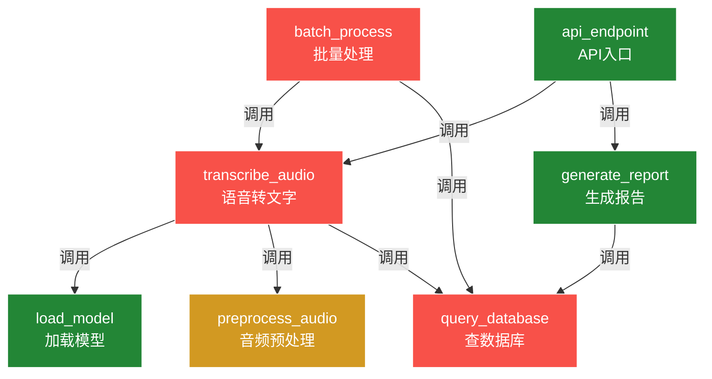

# 接口笔记 — AI语音项目（v2 — 手写修正版）

> *ℹ️ 本文档已通过人工校验（v2），如有疑问请联系维护者。*

> 生成时间：2026-07-18 10:30
> 接口总数：12
> 版本：v2
> 生成方式：AI全量扫描 + 用户手写批注

---

## transcribe_audio 🔴

- **功能**：将音频文件转为文字（支持中英文）
- **参数**：
  - `audio_path` (str) - 音频文件路径
  - `language` (str) - 语言代码，如 'zh'、'en'
  - `model` (str) - 使用的模型名称，默认 'whisper-base'
- **返回**：dict - 包含 text、confidence、duration
- **位置**：`core/transcribe.py`
- **调用了**：`load_model`, `preprocess_audio`, `query_database`
- **被调用**：`batch_process`, `api_endpoint`
- **风险**：🔴 高（手写修正：大文件超过60s必超时，要加分片逻辑）

> 📝 手写区：
>
> ⚠️ 163邮箱要单独配SMTP！
> 密码不是登录密码，是授权码
> （踩坑2026-07-16，排查了3小时）
> → 找老王问过，他说用SSL端口465
>
> _______________________________________________________

---

## load_model 🟢

- **功能**：加载语音识别模型到内存（懒加载，首次调用时执行）
- **参数**：
  - `model_name` (str) - 模型名称
  - `device` (str) - 运行设备 'cpu' 或 'cuda'
- **返回**：Model对象
- **位置**：`core/models.py`
- **调用了**：（无）
- **被调用**：`transcribe_audio`, `translate_audio`
- **风险**：🟢 低

> 📝 手写区：
>
> 首次加载约3-5秒，之后复用
> GPU模式需要CUDA 11.8+
>
> _______________________________________________________

---

## preprocess_audio 🟡

- **功能**：音频预处理（降噪、归一化、分帧）
- **参数**：
  - `audio_data` (bytes/numpy) - 原始音频数据
  - `sample_rate` (int) - 采样率，默认16000
- **返回**：numpy.ndarray
- **位置**：`core/audio_utils.py`
- **调用了**：（无）
- **被调用**：`transcribe_audio`
- **风险**：🟡 中（手写修正：采样率不匹配时不再崩溃，已加自动重采样，但仍需测试8kHz电话音频）

> 📝 手写区：
>
> 8kHz电话录音还没测过
> 上次小李说加个 resample 函数
>
> _______________________________________________________

---

## query_database 🔴

- **功能**：查询数据库中的转录记录
- **参数**：
  - `table` (str) - 表名
  - `condition` (dict) - WHERE条件
- **返回**：list[dict]
- **位置**：`db/query.py`
- **调用了**：（无）
- **被调用**：`transcribe_audio`, `generate_report`, `search_history`, `batch_process`
- **风险**：🔴 高（手写修正：超时未设，生产环境卡死过！加 timeout=10 就行。老王写的，他离职了，有问题问小李）

> 📝 手写区：
>
> 🔴 这里超时没设！
> 上次生产环境卡死就是这个接口
> → 加 timeout=10 就行
> → 老王写的，他离职了，有问题问小李
>
> _______________________________________________________

---

## generate_report 🟢

- **功能**：生成语音分析报告PDF
- **参数**：
  - `transcript_id` (int) - 转录记录ID
  - `format` (str) - 输出格式，默认 'pdf'
- **返回**：str - PDF文件路径
- **位置**：`reports/generator.py`
- **调用了**：`query_database`, `render_template`
- **被调用**：`api_endpoint`
- **风险**：🟢 低

> 📝 手写区：
>
> 模板在 templates/report.html
> 改样式找前端小张
>
> _______________________________________________________

---

## batch_process 🔴

- **功能**：批量处理音频文件
- **参数**：
  - `file_list` (list) - 文件路径列表
  - `parallel` (bool) - 是否并行，默认 False
- **返回**：list[dict]
- **位置**：`core/batch.py`
- **调用了**：`transcribe_audio`, `query_database`
- **被调用**：（无）
- **风险**：🔴 高（手写修正：并行模式内存泄漏确认！100+文件必崩。临时方案：每次处理50个sleep 1秒）

> 📝 手写区：
>
> 🔴 并行模式有内存泄漏！
> 跑100+文件必崩，OOM Killer
> 临时方案：每50个sleep 1s
> 根本解决要加进程池 + 显式GC
> → 找运维大刘，他研究过
>
> _______________________________________________________

---

## 📊 接口关系图

> 🔴 红色 = 高风险 | 🟡 黄色 = 中风险 | 🟢 绿色 = 稳定

---

> *本文档由 AI 辅助生成并经人工校验（v2），如有错误请联系维护者。*
