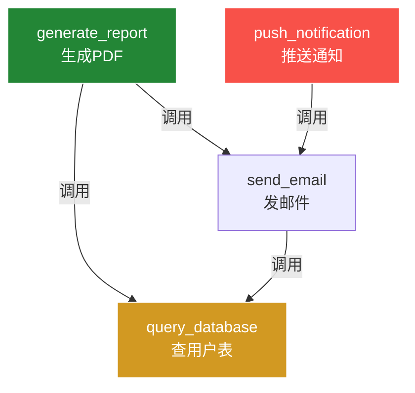

# 接口笔记 — 简单示例项目

> 生成时间：2026-07-17 18:00
> 接口总数：3
> 版本：v1
> 生成方式：AI自动记录

---

## send_email 🟢

- **功能**：发送邮件通知，支持HTML和纯文本
- **参数**：
  - `to` (str) - 收件人邮箱
  - `subject` (str) - 邮件标题
  - `body` (str) - 邮件内容（HTML）
- **返回**：bool - 是否发送成功
- **位置**：`utils/email.py`
- **调用了**：`query_database`
- **被调用**：`generate_report`, `push_notification`
- **风险**：🟢 低

> 📝 手写区（打印后在此写你的理解/踩坑经验）：
>
> _______________________________________________________
>
> _______________________________________________________
>
> _______________________________________________________

---

## query_database 🟡

- **功能**：查询用户表，返回字典列表
- **参数**：
  - `table` (str) - 表名
  - `condition` (dict) - WHERE条件
- **返回**：list[dict]
- **位置**：`db/query.py`
- **调用了**：（无）
- **被调用**：`send_email`, `generate_report`
- **风险**：🟡 中（超时未设，大数据量可能卡死）

> 📝 手写区（打印后在此写你的理解/踩坑经验）：
>
> _______________________________________________________
>
> _______________________________________________________
>
> _______________________________________________________

---

## generate_report 🟢

- **功能**：生成PDF报告并发送邮件通知
- **参数**：
  - `user_id` (int) - 用户ID
  - `report_type` (str) - 报告类型
- **返回**：str - PDF文件路径
- **位置**：`reports/generator.py`
- **调用了**：`query_database`, `send_email`
- **被调用**：（无）
- **风险**：🟢 低

> 📝 手写区（打印后在此写你的理解/踩坑经验）：
>
> _______________________________________________________
>
> _______________________________________________________
>
> _______________________________________________________

---

## 📊 接口关系图

> 🔴 红色 = 高风险 | 🟡 黄色 = 中风险 | 🟢 绿色 = 稳定
